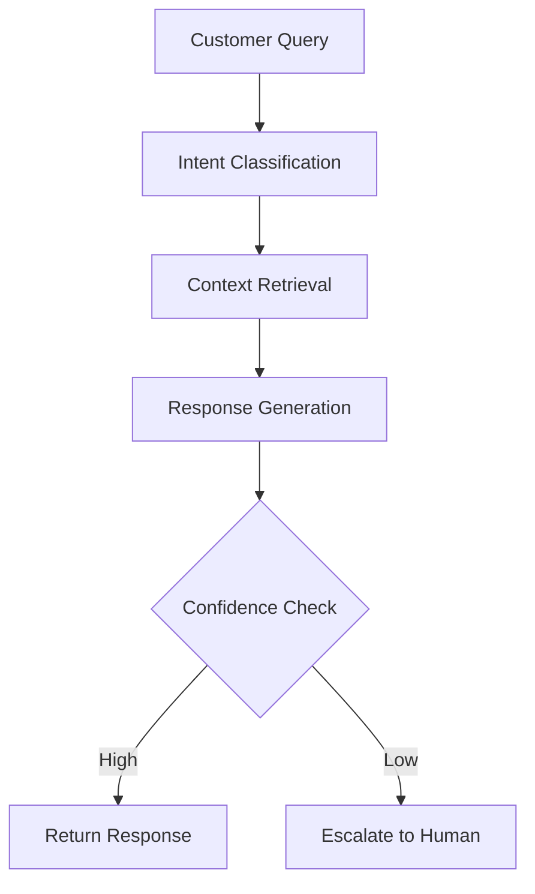

# 09 - GenAI Customer Support Assistant

An intelligent customer support system powered by generative AI with RAG (Retrieval-Augmented Generation) capabilities for accessing internal knowledge bases.

## 🎯 Overview

This agent automates and enhances customer support services by:
- Understanding customer queries in natural language
- Retrieving relevant information from internal documentation
- Generating contextual, helpful responses
- Learning from interactions to improve over time

## ✨ Features

- **Natural Language Understanding**: Processes customer queries in multiple languages
- **RAG Implementation**: Fetches relevant information from internal knowledge base
- **Real-time Responses**: Provides instant, contextual answers
- **Conversation Memory**: Maintains context across conversation threads

## 🛠️ Technology Stack

**Code Implementation:**
- OpenAI API / Anthropic Claude
- LangChain for orchestration
- LlamaIndex for document indexing
- Pinecone/Chroma for vector storage

**No-Code Implementation:**
- n8n workflow automation
- OpenAI integration nodes
- Database connectors
- Webhook triggers

## 🚀 Quick Start

### Code Implementation

1. **Setup Environment**
   ```bash
   cd code-implementation
   python -m venv venv
   source venv/bin/activate  # Windows: venv\Scripts\activate
   pip install -r requirements.txt
   ```

2. **Configure Environment Variables**
   ```bash
   cp .env.example .env
   # Edit .env with your API keys
   ```

3. **Run the Application**
   ```bash
   python main.py
   ```

### No-Code Implementation

1. **Import Workflow**
   - Open n8n
   - Import `nocode-implementation/workflow.json`
   - Configure your API credentials

2. **Setup Knowledge Base**
   - Upload your documents to the designated folder
   - Configure vector database connection

3. **Activate Workflow**
   - Test with sample queries
   - Deploy webhook endpoints

## 📈 Usage Examples

### Basic Query Handling
```python
# Example customer query
query = "How do I reset my password?"

# Agent processes and responds
response = customer_support_agent.process_query(query)
print(response.answer)
# Output: "To reset your password, please follow these steps..."
```

### Integration with Existing Systems
```python
# Webhook integration
@app.post("/customer-support")
async def handle_support_request(request: SupportRequest):
    response = await agent.process_query(request.message)
    return {"response": response.answer, "confidence": response.confidence}
```

## 🔍 Technical Deep Dive

### RAG Architecture
1. **Document Ingestion**: Process and chunk knowledge base documents
2. **Vector Embedding**: Convert text to embeddings using OpenAI
3. **Similarity Search**: Find relevant document chunks for queries
4. **Context Augmentation**: Combine retrieved context with user query
5. **Response Generation**: Generate contextual response using LLM

### Conversation Flow


## 🧪 Testing

```bash
# Run unit tests
pytest tests/

# Run integration tests
pytest tests/integration/

# Test with sample queries
python test_queries.py
```

## 📦 Deployment

### Docker Deployment
```bash
docker build -t genai-customer-support .
docker run -p 8000:8000 genai-customer-support
```

### Cloud Deployment
- **AWS**: Lambda + API Gateway
- **Google Cloud**: Cloud Run
- **Azure**: Container Instances

## 🐛 Troubleshooting

### Common Issues
1. **Slow Response Times**: Check vector database performance
2. **Low Accuracy**: Review knowledge base quality
3. **API Errors**: Verify API key configurations

### Debug Mode
```bash
python main.py --debug
```


## 📚 Resources

- [LangChain Documentation](https://python.langchain.com/)
- [OpenAI API Reference](https://platform.openai.com/docs)
- [n8n Documentation](https://docs.n8n.io/)

---

**Status**: ✅ Complete | **Last Updated**: June 2025